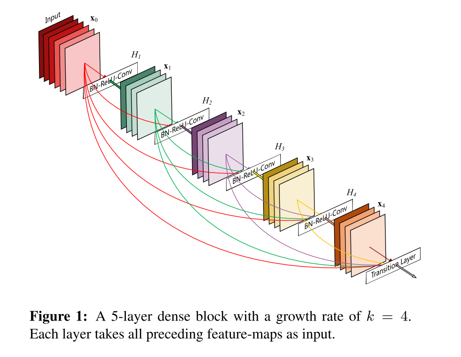
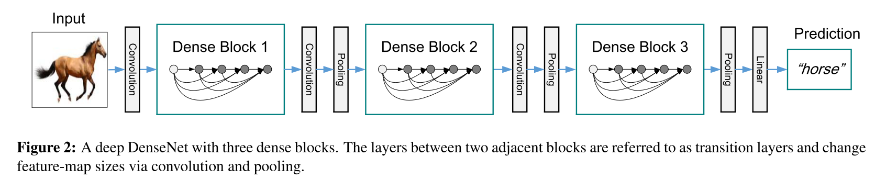
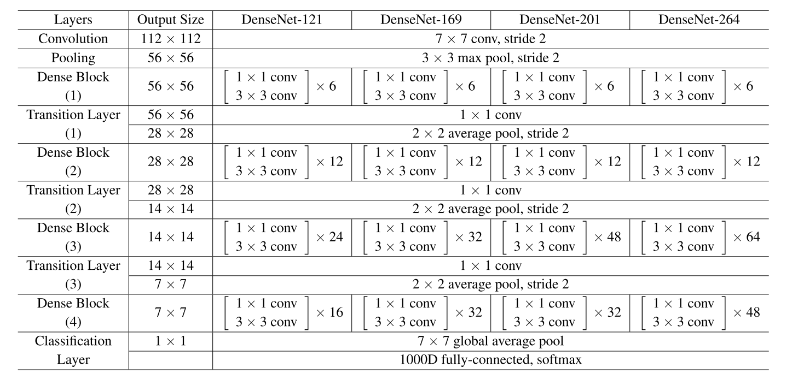

# DenseNet_keras_custom
Applying DenseNet model by keras after reading paper.

### DenseNet论文学习与keras实现
***
#### 前言
网络越来越深，一些问题也显现了出来，当输入和梯度进入网络传导，随着时间到达终点的时候会逐渐消失掉。

很多网络就是在解决这个问题，与DenseNet相似的如Highway Networks、ResNet等，他们的形式各有不同，如highway创建gate、resnet建立identity映射等，但他们都有一个共同的特点：**建立从低层到深层的shortcut。**

paper提到了DenseNet的几个优点：
1. 有效减缓梯度消失
2. 加强特征的传递
3. 鼓励特征的重复使用
4. 明显减少了参数量

**DenseNet**提出了一种概念，所有层接受其他层的input，同时也传输自己的output。而且区别于ResNet的地方是，在接受其他层的input的时候，不使用sum来整合，而是使用**concatenate**。

因此，假设l层有l个输入，那么一个L层的网络结构总共有L(L+1) \ 2连接。

DenseNet具有**更少的参数**，因为它认为网络中有很多不需要或没有很大作用的网络层可以直接舍弃，不需要学习多余的参数。论文指出，传统网络的前向传播是基于state的传播——接受上一层的输出，写入本层的信息，传递给下一层。这种传播传播的是一种状态，很多层只有很少量的作用但却有很大数量的独立权重，所以丢弃这些无用层可以减少很多参数量。

DenseNet的**宽度**较窄，只有一小部分的feature maps会作为collective knowledge，而最后的分类器也是根据**所有**的feature maps来进行决策。而且dense网络提高了信息和梯度在结构中的传播，每一层对于梯度和input都有直接的参与，这也有利于传向传播。并且Dense连接也有正则化的作用，可以减缓过拟合。

### DenseNet
#### ResNet的输出

其中，+操作是sum操作。
paper指出，sum操作会阻碍信息的传播。

#### Dense连接

为了提高信息传播，paper提出了Dense连接模型，如Figure 1. 于是有：

表示前l-1层的输出，组合操作为concatenate。

#### 复合function
同ResNet，之后的**conv.** 操作表示batch normalization、relu、3x3 conv操作。

#### Transition layer
concatenate操作只能在feature map的size相同的情况下操作，所有需要池化层来进行下采样。

为了方便下采样的进行，paper将网络结构划分为多个**dense blocks**。而两个dense blocks之间的卷积、池化操作称为**transition layer**。

**transition layer的卷积核应该是上个dense block产生的所有feature maps的个数。**

**transition layer由1x1 conv进行降维、2x2 average pooling** 组成。

#### Growth rete
假设l层的输出$H_l$产生$k$个feature maps，下一层总共有层input。paper把k称为growth rate，即每一次层产生输出的维度。

解释k，可以把网络总体的feature maps看作是网络的全局state，而每一层为这个global state加入自己产生的k层feature maps，即加入自身的state。对于这个全局state，每一层都可以直接接触到，而不像传统的networks是一层一层的传递。

#### Bottleneck layers
DenseNet同样提出了**瓶颈结构**。

瓶颈结构由一个1x1 conv.和3x3 conv.组成。其中，1x1 conv.输出维度为4k，3x3 conv.输出维度为k。

解释这个bottleneck，前层产生的n* kfeature maps，经过1x1 conv.降维到4k，再进行3x3 conv.，可以有效减少参数。

有bottleneck结构的DenseNet称为**DenseNet-B**。

#### 压缩
令m为上一个dense block含有的feature maps数量，则m也是transition layer的输出维度。令$[\theta m]$作为新的transition layer的输出维度，那么$\theta$则是一个可控的超参数。当$0<\theta <=1$，我们称$\theta$为压缩参量。作者的实验中使用$\theta =0.5$。

使用了压缩参量的模型称为**DenseNet-C**。

而同时使用了bottleneck和压缩参量的模型称为**DenseNet-BC**。

#### implementation details

上图为imagenet的网络结构。

* 而在除了imagenet的其他数据集，paper均只使用3个相同的dense block。
* 在第一个dense block之前，应该先使用一次卷积核为16的卷积（**对于imagenet，先使用了7x7 conv. s=2和3x3 max pool. s=2； 而对于cifar，因为输出size是32x32，所以只需要使用一次1x1 conv.即可**）。
* 经过dense block和transition layer，最后一个dense block之后使用一次全局average pooling。
* 输出使用softmax分类。

### 实现
[https://github.com/seiei17/DenseNet_keras_custom](
https://github.com/seiei17/DenseNet_keras_custom)

* 使用cifar数据集
* 对于50000个测试数据，选择5000作为validation，45000作为training data。
